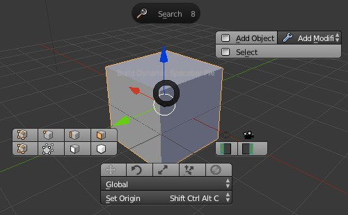
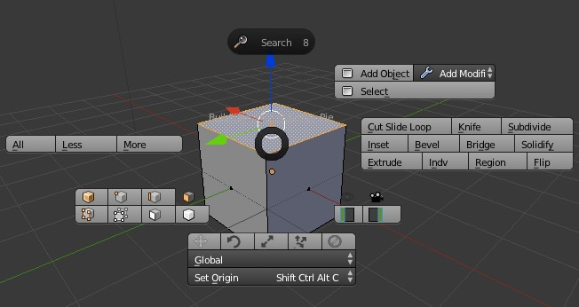
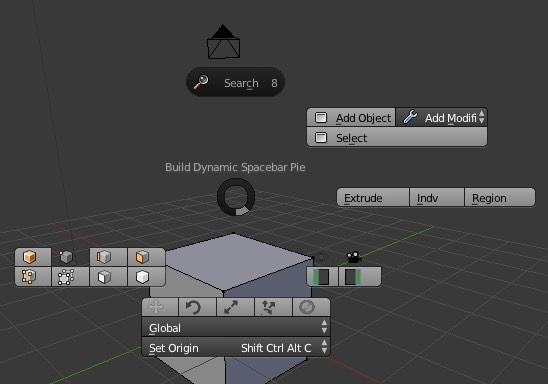

# blender_dynamic_pie_menu
A research experiment for creating more complex dynamic spacebar pie menus for Blender. Inspired by the dynamic space bar menu that comes with blender, this tries to do something similar but using the pie menu. It's hardcoded to be used with hitting the spacebar while the mouse has a 3d viewport in focus.

# what is it?
Based on the currently active context it shows only valid options and groups actions by theme.

# how to install
On OSX:
- right click on Blender App and select "show contents"
- navigate to a folder similar to "Applications/Blender/Contents/Resources/2.77/scripts/addons"
- create a folder in the "addons" folder with a name such as "DomsDynamicSpacebarPie"
- copy the "icons" folder into that and the "__init__.py" file - which is the script itself

# Status
This is unfinished and not production code. This is an experiment to see if it can be done to help casual blender noobs with backgrounds in 3ds max or the like to be able to jump into Blender on a casual basis without the steep learning curve that Blender still has.

The pie menu was not really programmed to offer what I was am trying to achieve. I haven't figured out a good way to handle custom activation state highlights expect by using custom images.

The most frustrating thing and the reason this is mostly abondonware is that Blender is still no very 3D-Manipulator driven, therefore triggering operations such as Extrude via the pie menu doesn't feel right and needs to additional custom coding to make it somewhat work.

I believe that Blender needs to come up with a nice API set to make various things easier such as custom Manipulators. It's really easy to do in Unity (unity3d).

Anyways, I put the script up here as it requires quite some research to understand how to do various things in regars to the pie menu - so having one script that combines ideas from various other scripts hopefully can shortcut research time for anybody looking into advanced custom pie menus.

Good luck.